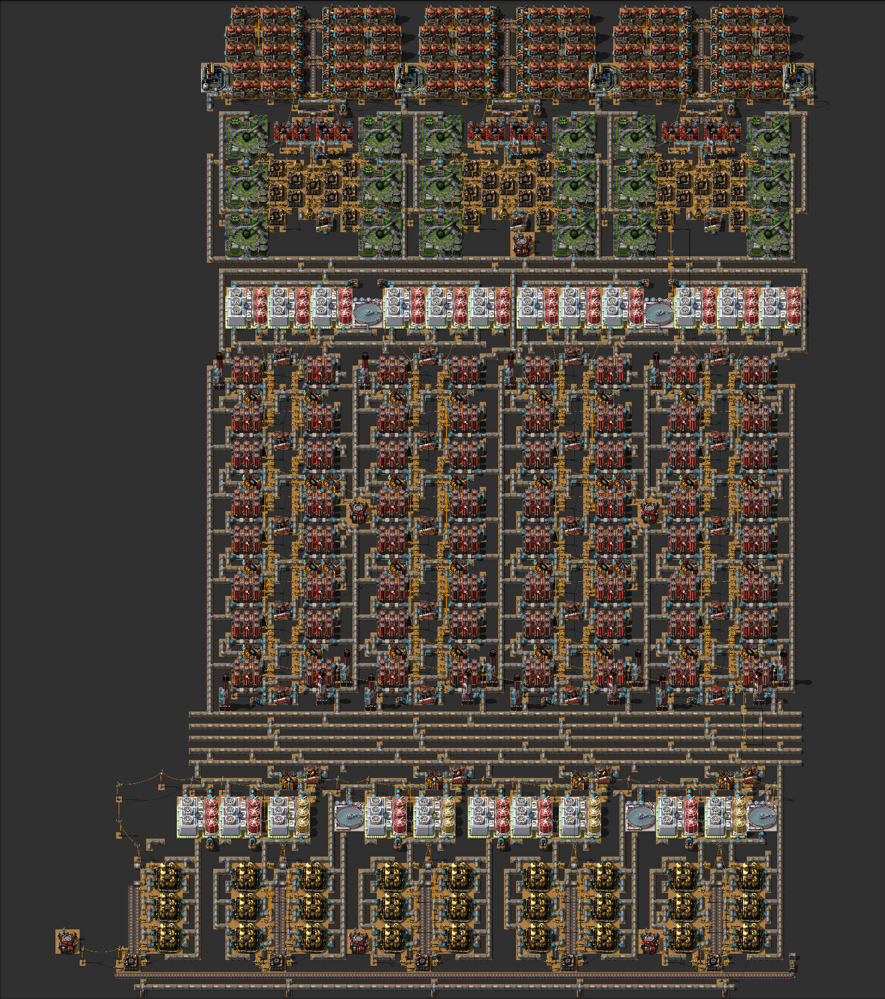

# Mineral Sludge & Solid Fuel Power

In this run I will be producing mineral sludge mostly via slag-2.

There are a couple of reasons behind this choice:
* Slag-2 enables production of solid fuel due to all excess hydrogen, which is only one research away (Flammables)
from the mandatory technologies.
* Electrolyzers have higher tier buildings which theoretically allow to have a much denser build.
* I'm playing on random map seed and wanted to reduce dependencies on trees and gardens to the absolute minimum.

The layouts below were originally designed to minimize bricks usage and to be upgradeable from slag-1 version. In order
to satisfy purified water demands the builds use a couple of chemical plants.

## 64 Slag-2 Electrolyzers MK1
Here's the idea of the Slag-2 build using MK1 buildings and producing 320 mineral sludge per second (able to support more boilers and steam engines):

Blueprint: [64_slag2_mk1.bp](blueprints/mineral_sludge/64_slag2_mk1.bp)

## 64 Slag-2 Electrolyzers MK2
Here's the idea of the Slag-2 build using MK2 buildings and producing 480 mineral sludge per second (power scaled properly):

Blueprint: [64_slag2_mk2.bp](blueprints/mineral_sludge/64_slag2_mk2.bp)

NOTES:
* It's possible to add a clarifier for saline water inside each power plant.
* Upgrading some filtration units from MK1 to MK3 can alleviate the need for an extra half-stack of filtration units.

## 64 Slag-2 Electrolyzers MK4 with MK1 beacons

The builds above are upgradeable to MK4 and have room for some speed beacons between the liquefiers.

Purified water production will become an issue, in which case more chemical plants would need to be added.
Chemical plants would also address pipe throughput issue for hydrogen.

I will update this section if I end up going ahead with this idea.
