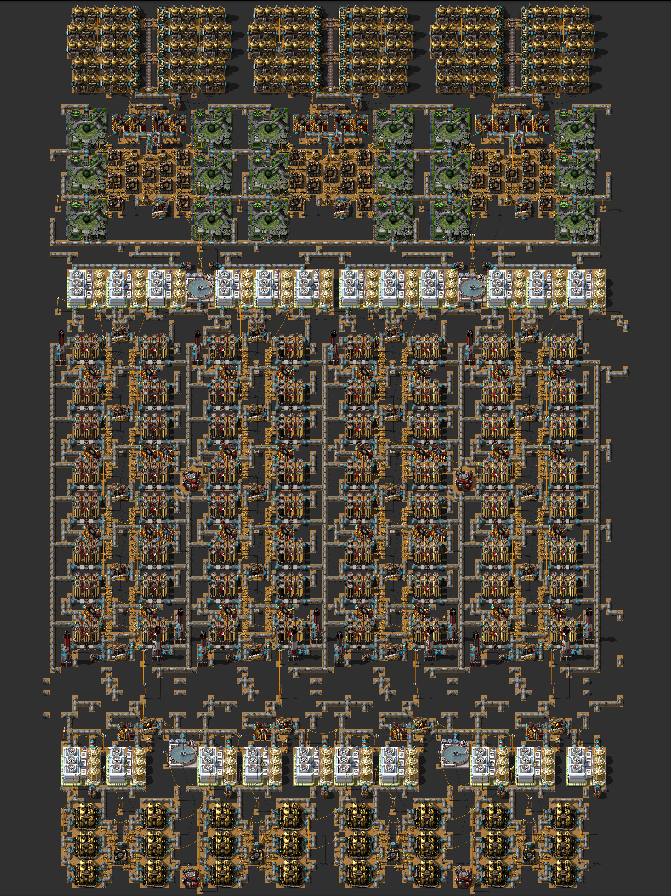

# Mineral Sludge & Solid Fuel Power

In this run I will be producing mineral sludge mostly via Fast Dirty Water Electrolysis (aka slag-2).

There are essentially three options for mineral sludge production in Seablock:
* Slag-1: good only in heavily-beaconed setups.
* Slag-2: imho the best process for mineral sludge production.
* Geodes: very strong alternative to slag-2, mandatory for direct sorting of t2+ ores.

There are a couple of reasons behind the slag-2 choice:
* Slag-2 enables production of solid fuel due to all the excess hydrogen, which is only one research away (Flammables)
from the mandatory technologies.
* Electrolyzers have higher tier buildings which theoretically allow to have a much denser build.
* I'm playing with a random map seed and wanted to reduce dependencies on trees and gardens to the absolute minimum.

The layouts below were originally designed to minimize bricks usage and to be upgradeable from slag-1 version. In order
to satisfy purified water demands the builds use a couple of chemical plants.

## Overall Structure

My mineral sludge build consists of the following sections, from top to bottom:
* Algae-2 solid fuel power plant
* Slag slurry / Slag-2 (electrolyzers & liquefiers)
* Mineral sludge & sulfuric acid (filtration units)
* Algae-2 charcoal for filtration units
* Mineral sludge balancer with 12k/s throughput

I will have three copies of this mineral sludge build: for t1 ores, for t2 ores and for t3 ores.

Fluid balancers purpose is to ensure the mineral sludge from the mineral sludge build reaches
ore crystallization & sorting build.
Nevertheless, I will do my best to match local sludge production and consumption rates.
For the endgame MK4 build that's 700 mineral sludge per second.

## Build Tiers

Speaking of production rates, the mineral sludge build is available in multiple tiers:

| Tier | Output | Beacons | Modules | Upgradability                 | Notes             |
|------|--------|---------|---------|-------------------------------|-------------------|
| MK1  | 160/s  | none    | none    | N/A                           | early-game build  |
| MK2  | 240/s  | none    | none    | in-place                      | a must have       |
| MK3  | 320/s  | none    | none    | in-place                      | cost-inefficient? |
| MK4  | 700/s  | none    | none    | some pipes need to be removed | end-game build    | 

### 32 Slag-2 MK1 (160/s)
Here's the 2x32 Slag-2 build using MK1 buildings and producing 320 mineral sludge per second.
The build is doubled to highlight alignment with algae-2 solid fuel power plants.

Slag-2 staged blueprints: [32_slag2_mk1](blueprints/mineral_sludge/32_slag2_mk1.bp)

Filtration units blueprints: [6_sludge_mk1_di](blueprints/mineral_sludge/6_sludge_mk1_di.bp)

NOTES:
* Filtration units build is oversized, so fewer copies are needed in the actual base.
* Power plants can support more MK1 boilers and steam engines (sized with MK2 in mind).

### 32 Slag-2 MK1 (240/s)
This is an in-place upgrade of MK1 build above.

I might share the blueprints once I reach this stage in the game.

NOTES:
* Upgrading some filtration units from MK1 to MK3 can alleviate the need for an extra half-stack of filtration units.

### 32 Slag-2 MK3 (320/s)

This is an in-place upgrade of MK2 build above.

I might share the blueprints once I reach this stage in the game.

### 32 Slag-2 MK4 (700/s)

This is the final tier of the mineral sludge build. Almost upgradeable in place, with the following differences:
* add offshore pumps
* remove pipe connection between left and right electrolyzer lines to free up space for a beacon
* remove some underground pipes to free up space for purified water chemical plants;
the hydrogen inputs for chemical plants are present since T1 version of the build

The build is speed-beaconed due to the high cost of MK4 electrolyzers and relatively low cost of Speed-0 modules and
T1 beacons.

I will share the blueprints once I reach this stage in the game.

NOTES:
* Chemical plants serve two purposes:
  * to make the build work with the limited amount of purified water from hydro plants
  * to reduce the amount of hydrogen gas exported from the build via the pipes

## Algae-2 solid fuel

I have two blueprint books prepared for this: one for building the power plant in left-to-right direction, another for
building it in right-to-left direction. The only difference are the two inserters feeding the stone furnace for the
liquefier.

MK1 version of the build can support more MK1 boilers and steam engines.
I'm saving landfill with and upgrade to MK2 version in mind.

MK1 left-to-right staged blueprint: [6_algae2_left](blueprints/mineral_sludge/6_algae2_left.bp)

MK1 right-to-left staged blueprint: [6_algae2_right](blueprints/mineral_sludge/6_algae2_right.bp)

MK2 version of the build has the following differences:
* MK2 chemical plants for solid fuel
* MK2 boilers (10 total)
* MK2 steam engines (20 total)

## Algae-2 charcoal

This is the idea for the local production of charcoal, needed to feed filtration units.

Blueprint: TODO

## Mineral sludge balancer

The balancer is designed to transport fluid over long distances with low latency and high throughput.

High throughput (12k/s) is achieved by using only tank-pump-tank and tank-pump-pump-tank connections.

High latency is achieved by doing the following at each balancing point:
* calculate the amount of fluid on each side
* calculate the number of sections on each side
* get the average amount of fluid per section on each side by dividing the numbers
* enable pump if the average amount of fluid on one side is too high
compared to the average amount of fluid on the other side

Blueprint: TODO